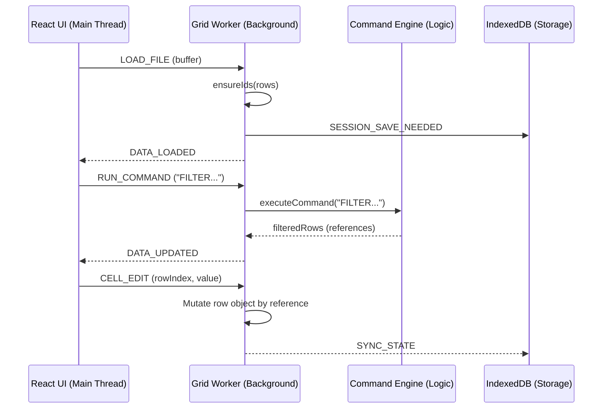
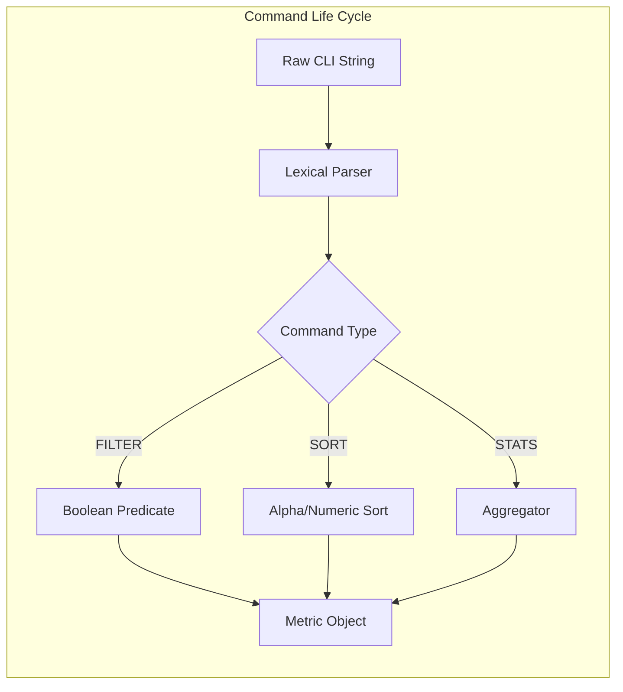

# DevsGrid - High-Performance Data Analysis Engine

DevsGrid is a powerful, browser-based data analysis tool designed to handle large datasets with ease. It features an off-thread processing engine, a SQL-like command interface, and persistent session management.

## 🏗️ Technical Architecture

DevsGrid employs a multi-tiered architecture to ensure a fluid user experience even when processing hundreds of thousands of rows.

### 1. Presentation Tier (React)
- **State Management**: Manages only the visible metadata and the current slice of data received from the worker.
- **I/O Handling**: Orchestrates file uploads via `FileReader` and triggers downloads for exports.
- **Event Bus**: Captures user interactions (CLI commands, cell edits, toolbar filters) and dispatches them to the worker via a structured message protocol.

### 2. Processing Tier (Web Worker)
- **Data Encapsulation**: Houses the `masterData` (raw source) and `currentData` (active view).
- **Concurrency**: Operations like heavy sorting, filtering, and complex regex matching are executed in a dedicated background thread, preventing "Jank" in the UI.
- **History Management**: Implements an atomic Undo/Redo system. Each action is recorded with unique row IDs, allowing state restoration regardless of current sorting or filtering.

### 3. Persistence Tier (IndexedDB)
- **Session Continuity**: Uses `Dexie.js`/`IndexedDB` to store file buffers and JSON state.
- **Auto-Sync**: The worker triggers a `SESSION_SAVE_NEEDED` event upon mutations, which the main thread commits to local storage.



---

## ⚙️ Engine Internal Logic: The "FastGrid" Core

The engine is split into two specialized units: the **Stateful Worker** and the **Stateless Executor**.

### 🛠️ The Executor (`commandEngine.js`) - Custom Lexical Parser
Instead of relying on heavy external libraries (like `sql-parser` or `nearley`), the engine uses a **custom-coded, zero-dependency lexical parser** built specifically for performance.

- **Tokenization**: Uses high-performance regex-based splitting (`.split(/\s+/)`) to tokenize inputs into a predictable array structure.
- **Lexical Parsing**: Commands are manually parsed based on positional token indices (e.g., `Index 0` for Op, `Index 1` for Col).
- **Type Inference**: A lightweight inference engine automatically handles numeric vs. string comparisons and explicitly manages `NA` (Not Available) values to ensure they don't break sorting/math.
- **Projection**: The `SELECT` command uses object mapping to create lightweight "views" of the data for specialized exports.

### 🧠 The Worker Logic (`gridWorker.js`)
The worker maintains a **Virtual DOM-like** approach to data state:
- **Reference Preservation**: When filtering or sorting, the engine returns new arrays but keeps references to the original row objects in `masterData`. This allows a cell edit on a filtered view to automatically propagate to the source-of-truth.
- **Atomic ID Injection**: Every row is assigned a collision-resistant `_id` upon ingestion. This ID is the anchor for all history and deletion operations.



---

### 🕒 History & Persistence
- **Action-Based History**: Instead of storing full snapshots, we store "reverse actions" (e.g., storing the `oldValue` during an edit).
- **Debounced Sync**: State is pushed to the main thread for persistence only when significant changes occur, optimizing message-passing overhead.

## 📂 Folder Structure

```text
frontend/
├── src/
│   ├── components/      # React UI (DataGrid, Toolbar, CommandBar)
│   ├── engine/          # SQL-like processing logic (commandEngine.js)
│   ├── workers/         # Background processing (gridWorker.js)
│   ├── services/        # IndexedDB persistence (db.js)
│   ├── hooks/           # Custom React hooks
│   ├── styles/          # Global and component styles
│   └── App.jsx          # Main application orchestration
├── public/              # Static assets
└── vite.config.js       # Build configuration
```

## 🚀 Getting Started

1. **Install Dependencies**: `npm install`
2. **Run Dev Server**: `npm run dev`
3. **Build Prod Bundle**: `npm run build`
